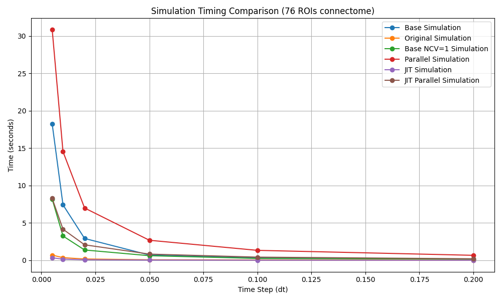
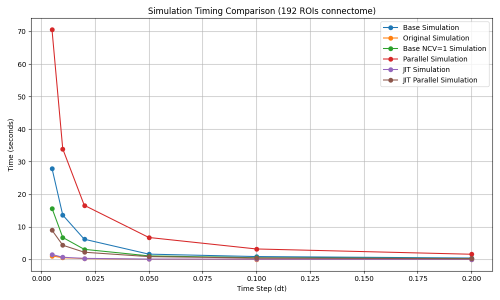
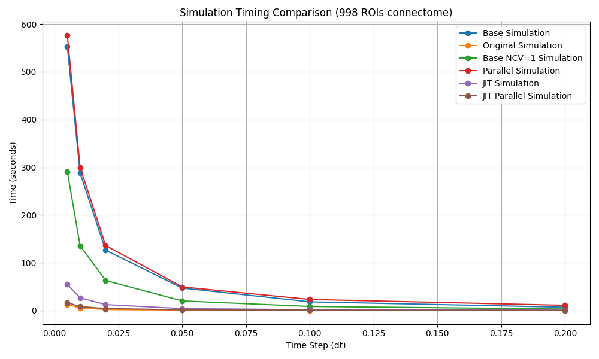
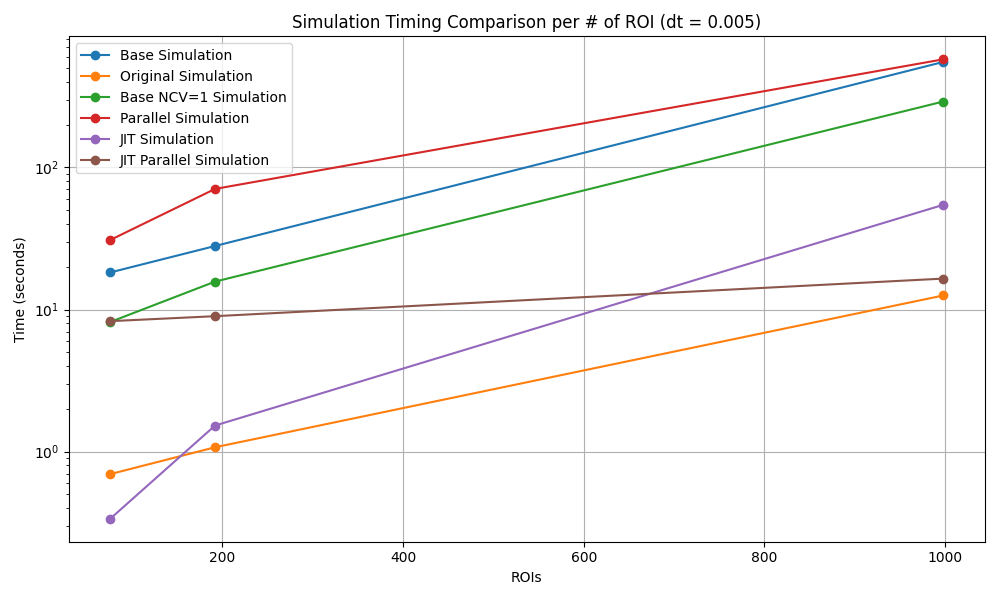

# Performance Comparison of `tvb-algo` Implementations

This repository compares the performance of different implementations of the same algorithm in pure Python. The algorithm was originally from the [tvb-algo](https://github.com/maedoc/tvb-algo) repository, which is a collection of algorithms for simulating brain activity on the [The Virtual Brain](https://www.thevirtualbrain.org/) platform. For simplicity, random noise is removed from the algorithm.

## Algorithms Tested
- **Original**: The original implementation (in `NumPy`), with noise removed.
- **Base**: A 1-to-1 translation to pure Python (without `NumPy`).
- **Base (Single State Variable)**: Optimized version that uses only a single state variable.
- **Parallel**: Parallelized using `concurrent.futures` with up to 32 threads.
- **JIT**: Compilation with `numba` to machine code.
- **JIT + Parallel**: Combination of `numba` and parallelization with `prange`.

## Implementations

Several implementations of the algorithm are tested in terms of performance. The following implementations were considered:

### 1. **Original**
The original implementation of the algorithm is written in `NumPy`. In this case, the random noise is removed to simplify the comparison. This version serves as the baseline for the performance comparison.

### 2. **Base**
This implementation is a **1-to-1 translation** of the original `NumPy` code to pure Python. In this version:
- Every 2D or 3D array is converted to a list of lists.
- NumPy functions are replaced with loops and list comprehensions.
This approach results in a Python implementation that mimics the original but without using any external libraries like `NumPy`.

### 3. **Base (Single State Variable)**
In this implementation, I used the fact that the example script only uses a **single state variable** per iteration. This realization allows us to:
- Remove unnecessary loops and list comprehensions.
- Refactor the code to improve efficiency.
This results in a cleaner and more efficient version of the base implementation.

### 4. **Parallel**
The parallel implementation utilizes the `concurrent.futures` module to parallelize the computation across multiple CPU cores. It uses a `ThreadPoolExecutor` with a maximum of **32 threads** (this can be adjusted to match the available CPU cores on your machine). This allows for parallel execution of the algorithm, improving performance on multi-core systems.

### 5. **JIT**
In this implementation, I used the `numba` library to compile the Python code to **machine code**. This can significantly speed up computations by optimizing the execution at runtime, offering a performance boost without requiring manual optimizations in the code.

### 6. **JIT + Parallel**
This version combines the `numba` library with parallelization. It uses the `prange` function to parallelize the computation across multiple CPU cores. This approach maximizes performance by compiling the code to machine code and using parallel computation.


## Parallelization
The part of the code that could really benefit from parallelization is the loop computes the states of the ROIs. Each ROI can be computed independently, making it possible to do parallel work. The part of the code that iterates over time can not be parallelized, as it depends on the previous state of the system.

To rank the performance of the implementations, I used the following variables:
```python

speed = 1.0
tf = 150.0
k = 1e-3
freq = 1.0

dt_values = [
    0.005,
    0.01,
    0.02,
    0.05,
    0.1,
    0.2,
]
```

The different `dt` values are not that important for the performance comparison. Since none of the implementations are parallelized over time, the complexity will always be dependent on `dt` by 1/`dt`.


---

# Results

I have testing each algorithm with three different datasets, each with a different number of connected ROIs (Regions of Interest). We ran the algorithm with various time steps (`dt`) to test the performance for increasing complexity. A smaller `dt` value means more iterations and a longer computation time.

### Table 1: Results for 76 ROIs

| **dt**  | **Base** | **Original** | **Base NCV=1** | **Parallel** | **JIT** | **JIT Parallel** |
|---------|----------|--------------|----------------|--------------|---------|------------------|
| 0.005   | 18.2333  | 0.6949       | 8.1738         | 30.8425      | 0.3373  | 8.2826           |
| 0.01    | 7.4151   | 0.3546       | 3.2477         | 14.5333      | 0.1554  | 4.1546           |
| 0.02    | 2.9204   | 0.1779       | 1.3802         | 6.9949       | 0.0753  | 2.0726           |
| 0.05    | 0.7042   | 0.0708       | 0.6156         | 2.6806       | 0.0298  | 0.8304           |
| 0.1     | 0.3208   | 0.0363       | 0.2466         | 1.3307       | 0.0148  | 0.4247           |
| 0.2     | 0.1563   | 0.0179       | 0.1612         | 0.6662       | 0.0074  | 0.2046           |

*Figure 1: Performance Comparison for 76 ROIs*  


---

### Table 2: Results for 192 ROIs

| **dt**  | **Base** | **Original** | **Base NCV=1** | **Parallel** | **JIT** | **JIT Parallel** |
|---------|----------|--------------|----------------|--------------|---------|------------------|
| 0.005   | 27.9790  | 1.0737       | 15.7172        | 70.5493      | 1.5268  | 8.9790           |
| 0.01    | 13.6293  | 0.5377       | 6.7612         | 33.9493      | 0.6836  | 4.3769           |
| 0.02    | 6.2119   | 0.2672       | 3.1108         | 16.6322      | 0.3360  | 2.2218           |
| 0.05    | 1.6353   | 0.1085       | 1.0994         | 6.7511       | 0.1324  | 0.8744           |
| 0.1     | 0.8930   | 0.0545       | 0.5351         | 3.2225       | 0.0657  | 0.4341           |
| 0.2     | 0.4424   | 0.0266       | 0.2679         | 1.6014       | 0.0328  | 0.2203           |

*Figure 2: Performance Comparison for 192 ROIs*


---

### Table 3: Results for 998 ROIs

| **dt**  | **Base** | **Original** | **Base NCV=1** | **Parallel** | **JIT** | **JIT Parallel** |
|---------|----------|--------------|----------------|--------------|---------|------------------|
| 0.005   | 552.1261 | 12.5575      | 290.7044       | 576.0387     | 54.5474 | 16.5065          |
| 0.01    | 287.8177 | 5.3201       | 135.6038       | 299.5439     | 26.5942 | 8.2334           |
| 0.02    | 126.2115 | 2.1016       | 62.7783        | 135.9201     | 12.3153 | 4.0327           |
| 0.05    | 46.9657  | 0.7921       | 20.0330        | 49.3217      | 3.9874  | 1.5196           |
| 0.1     | 18.1087  | 0.3374       | 8.4850         | 23.1070      | 1.7724  | 0.7424           |
| 0.2     | 6.8885   | 0.1612       | 3.1363         | 10.8503      | 0.8544  | 0.3626           |

*Figure 3: Performance Comparison for 998 ROIs*


### Table 4: Results for dt = 0.005 per ROI Count
| **ROIs** | **Base** | **Original** | **Base NCV=1** | **Parallel** | **JIT** | **JIT Parallel** |
|----------|----------|--------------|----------------|--------------|---------|------------------|
| 76       | 18.2333  | 0.6949       | 8.1738         | 30.8425      | 0.3373  | 8.2826           |
| 192      | 27.9790  | 1.0737       | 15.7172        | 70.5493      | 1.5268  | 8.9790           |
| 998      | 552.1261 | 12.5575      | 290.7044       | 576.0387     | 54.5474 | 16.5065          |

*Figure 4: Performance Comparison for dt = 0.005 per ROI Count*


---

# Analysis

In figures 1-3, we can see, as expected, that the performance trend follows 1/`dt`. This is not surprising, because there is no optimization done in the time loop.

We can also notice that the the first and second **Base** implementations are very similar in performance. The **Base NCV=1** implementation is significantly faster than the original, as it is and optimized version of the first one. Both implementation are both performing worse than the original, as they are not using `NumPy` and are not optimized for performance.

The **Parallel** implementation is the slowest of all implementations. The main reason for this is that the parallelization is done using threads. This create a lot of overhead, as the threads need to transfer data and synchronize with each other. The performance is slower even than the base implementation, which is not parallelized. The computation done by each seperate thread is not enough to overcome the overhead of the threads. You can see this in the code:
```python
def compute_derivatives(
    x: float, y: float, c: float, freq: float
) -> tuple[float, float]:
    dx = freq * (x - x**3 / 3 + y) * 3.0
    dy = freq * (1.01 - x + c) / 3.0

    return dx, dy
```

The `compute_derivatives` function is that main calculation performed by each thread, and is not a heavy computation.

The **JIT** implementation is has similar performance to the **Original** implementation, which uses `NumPy`. As the number of ROIs increases, the performance of the JIT implementation is a bit worse than the original. This is likely due to the fact that `NumPy` is quite well optimized for these kinds of operations.

The **JIT Parallel** implementation is initially slower than the **JIT** implementation, but as the number of ROIs increases, it becomes faster. This is because the `prange` function used in the JIT implementation allows for parallelization of the computation across efficiently. At higher ROI counts (giving a better parallelization), the performance of the JIT Parallel implementation is noticeably better than the other implementations. It never reaches the performance of the original, `NumPy` implementation, but it is significantly faster than the other implementations.